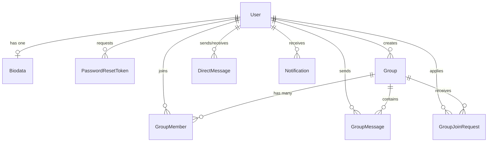

# 📋 Dokumentasi Fitur Aplikasi Chatting (ChatSphere)

Dokumen ini memuat rangkuman menyeluruh dari seluruh fitur yang telah selesai dibangun pada aplikasi **ChatSphere** (Backend NestJS + Frontend Native SPA + Database PostgreSQL + Real-Time WebSocket).

---

## 🏗️ 1. Arsitektur & Teknologi

- **Backend**:
  - **Framework**: [NestJS 11](https://nestjs.com/) (Modular Monolith Architecture).
  - **ORM**: [Prisma 7](https://www.prisma.io/) dengan PostgreSQL database.
  - **Real-Time Engine**: [Socket.io](https://socket.io/) Gateway pada namespace `/ws`.
  - **API Documentation**: [Swagger / OpenAPI](http://localhost:3000/api/docs) otomatis di `/api/docs`.
  - **Health Monitoring**: Endpoint `/api/v1/health` dan `/api/v1/health/ping` di posisi rute teratas/terbawah.
- **Frontend**:
  - **Teknologi**: 100% Native Web SPA (**Vanilla HTML5, CSS3, JavaScript ES6+**).
  - **Desain**: Sleek modern dark mode dengan sentuhan glassmorphism (`backdrop-filter`), font modern Inter, micro-animations, dan tata letak responsif desktop/mobile.
  - **Penyajian**: Disajikan langsung (*static assets*) oleh NestJS dari folder `public/`.
- **Keamanan & Autentikasi**:
  - Hashing password menggunakan **bcrypt**.
  - Autentikasi stateless menggunakan **JWT (JSON Web Token)**.
  - **Role-Based Access Control (RBAC)**: `ADMIN` dan `USER`.

---

## 🔐 2. Modul Autentikasi (Authentication)

| Fitur | Deskripsi | Endpoint API |
|---|---|---|
| **Login** | Masuk menggunakan Email & Password. Menghasilkan JWT Access Token. Terdapat tombol cepat demo untuk akun Admin & User di UI. | `POST /api/v1/auth/login` |
| **Request Reset Password** | Meminta token reset password yang dikirimkan ke email terdaftar. | `POST /api/v1/auth/reset-password-request` |
| **Confirm Reset Password** | Memasukkan token reset dan menetapkan password baru. | `POST /api/v1/auth/reset-password` |
| **Logout** | Mengakhiri sesi login dan membersihkan token lokal di sisi klien. | `POST /api/v1/auth/logout` |
| **Proteksi JWT & Guard** | Mengamankan seluruh endpoint internal dengan `JwtAuthGuard` dan ekstraksi user via decorator `@GetUser()`. | Middleware & Guard |

---

## 👥 3. Modul Pengguna & Biodata (Users Management)

Struktur data pengguna dipisahkan secara rapi menjadi 2 tabel:
- **Tabel `users`**: Menyimpan kredensial (`email`, `password`, `created_at`, `deleted_at`).
- **Tabel `biodata`**: Menyimpan profil (`first_name`, `last_name`, `role`: `ADMIN`/`USER`, `is_active`).

### Fitur Pengguna:
- **Lihat Profil Sendiri**: Menampilkan informasi akun dan biodata pengguna yang sedang login (`GET /api/v1/users/me`).
- **Pembaruan Profil**: Memperbarui nama depan dan nama belakang (`PATCH /api/v1/users/:id`).
- **Daftar Pengguna untuk User Biasa**: Pengguna biasa dapat melihat daftar sesama pengguna aktif untuk memulai Pesan Pribadi (PC) atau menambahkan teman ke grup.
- **Manajemen Pengguna Khusus Admin**:
  - **Registrasi Pengguna Baru**: Hanya akun dengan peran `ADMIN` yang dapat mendaftarkan akun baru ke sistem (`POST /api/v1/users`).
  - **Soft Delete**: Menghapus pengguna secara aman tanpa membuang baris data fisik (`DELETE /api/v1/users/:id`), mencatat `deleted_at`.
  - **Filter Pengguna Terhapus**: Admin dapat memilih untuk melihat daftar pengguna aktif saja atau menyertakan pengguna yang di-*soft delete* (`GET /api/v1/users?includeDeleted=true`).
  - **Panel Manajemen User (UI)**: Modal tabel interaktif khusus Admin lengkap dengan status badge akun (`Aktif` / `Soft Deleted`), tombol edit biodata/role, dan konfirmasi soft delete.

---

## 💬 4. Modul Pesan Pribadi (Personal Chat / PC / Direct Message)

Fitur komunikasi langsung satu-lawan-satu antar pengguna:
- **Mulai Chat PC**: Pengguna dapat memilih kontak dari daftar pengguna aktif melalui tombol `+ Pesan PC`.
- **Kirim Pesan Langsung**: Mengirim pesan teks 1-on-1 secara instan (`POST /api/v1/chat/pc/messages`).
- **Riwayat Percakapan (History)**: Mengambil seluruh riwayat pesan dengan pengguna tertentu (`GET /api/v1/chat/pc/:userId/messages`).
- **Daftar Percakapan Terkini**: Daftar kontak yang pernah berkomunikasi dengan pengguna ditampilkan di sidebar tab PC (`GET /api/v1/chat/pc/conversations`).
- **Real-Time Event**: Pesan dikirimkan secara langsung ke penerima dan pengirim melalui event WebSocket `pc_message`.
- **Floating Toast**: Notifikasi mengambang otomatis muncul jika ada pesan pribadi baru saat sedang membuka jendela lain.

---

## 👥 5. Modul Grup Obrolan ala WhatsApp (WhatsApp-Style Group Chat)

Sesuai dengan ketentuan standar WhatsApp, grup obrolan dirancang dengan aturan berikut:

### A. Sifat Grup
- **Grup Bersifat Privat**: Tidak ada direktori publik terbuka (*tidak ada fitur browse/jelajahi semua grup*). Pengguna hanya dapat melihat grup yang diikutinya.
- **Hierarki Peran dalam Grup**:
  - `OWNER`: Pembuat grup, memiliki kontrol penuh.
  - `ADMIN`: Pengurus grup yang ditunjuk.
  - `MEMBER`: Anggota biasa.

### B. Alur Masuk Grup via Tautan Undangan (Invite Link)
1. **Pembuatan Tautan Undangan**:
   - Setiap grup memiliki kode undangan unik otomatis (`invite_code`, contoh: `inv_a1b2c3d4`).
   - Owner/Admin grup dapat melihat dan menyalin tautan undangan (`GET /api/v1/chat/groups/:id/invite-code`).
   - Owner/Admin grup dapat menarik/me-reset tautan (*Tarik Tautan*) kapan saja (`POST /api/v1/chat/groups/:id/revoke-invite`) sehingga tautan lama hangus.
2. **Pratinjau Grup (Preview)**:
   - Calon anggota yang menerima tautan/kode undangan dapat menekan tombol **"🔗 Gabung Link"** di sidebar atau membuka tautan langsung `http://localhost:3000/#invite=inv_xxx`.
   - Menampilkan kartu pratinjau grup berisi: Avatar, Nama Grup, Deskripsi, dan Jumlah Anggota (`GET /api/v1/chat/groups/invite/:code`).
3. **Persetujuan Admin/Owner (*Approve New Participants*)**:
   - Calon anggota menekan tombol **"Minta Bergabung"** (`POST /api/v1/chat/groups/invite/:code/request`).
   - Sistem mencatat permohonan berstatus `PENDING` pada model `GroupJoinRequest`.
   - Status tombol pemohon berubah menjadi **"⏳ Permintaan Menunggu Persetujuan"**.
   - Owner dan Admin grup menerima notifikasi real-time `JOIN_REQUEST_RECEIVED`.
4. **Persetujuan / Penolakan oleh Admin**:
   - Owner dan Admin grup melihat daftar permohonan tertunda di panel **"Permintaan Bergabung"** pada drawer Detail Grup (`GET /api/v1/chat/groups/:id/join-requests`).
   - **Tombol Terima (Approve)**:
     - Mengubah status request menjadi `APPROVED`.
     - Pengguna dimasukkan ke tabel `group_members` sebagai `MEMBER`.
     - Pemohon menerima notifikasi `JOIN_REQUEST_APPROVED` dan grup langsung muncul di sidebarnya.
     - Anggota grup lainnya menerima notifikasi `USER_JOINED_GROUP`.
   - **Tombol Tolak (Reject)**:
     - Mengubah status request menjadi `REJECTED`.
     - Pemohon menerima notifikasi `JOIN_REQUEST_REJECTED`.

### C. Manajemen Anggota & Pesan Grup
- **Tambah Anggota Langsung**: Hanya Owner dan Admin grup yang dapat memasukkan pengguna lain secara langsung dari daftar kontak (`POST /api/v1/chat/groups/:id/members`).
- **Keluarkan Anggota**: Hanya Owner dan Admin grup yang dapat mengeluarkan anggota lain dari grup (`DELETE /api/v1/chat/groups/:id/members/:userId`).
- **Keluar Mandiri (*Leave Group*)**: Setiap anggota biasa dapat keluar dari grup secara mandiri melalui tombol **"🚪 Keluar dari Grup"** di drawer Detail Grup.
- **Kirim & Terima Pesan Grup Real-Time**:
  - Kirim pesan: `POST /api/v1/chat/groups/:id/messages`.
  - Riwayat pesan: `GET /api/v1/chat/groups/:id/messages`.
  - Disiarkan real-time ke room WebSocket grup terkait melalui event `group_message`.

---

## 🔔 6. Modul Notifikasi Real-Time & Persisten (Notifications)

Sistem notifikasi ganda yang tersimpan di database PostgreSQL sekaligus disiarkan via WebSocket:

### A. Tipe Notifikasi yang Didukung:
1. 👤 `USER_REGISTERED`: Dikirimkan saat Admin mendaftarkan pengguna baru ke sistem.
2. 🎉 `ADDED_TO_GROUP`: Dikirimkan ke pengguna saat ditambahkan langsung ke dalam grup oleh Admin grup.
3. ⚠️ `REMOVED_FROM_GROUP`: Dikirimkan saat pengguna dikeluarkan oleh Admin grup atau saat ada anggota yang meninggalkan grup.
4. 👥 `USER_JOINED_GROUP`: Dikirimkan ke seluruh anggota grup saat ada calon anggota baru yang permohonannya disetujui.
5. 📩 `JOIN_REQUEST_RECEIVED`: Dikirimkan khusus ke Owner & Admin grup saat ada pengguna yang mengajukan permohonan masuk via tautan undangan.
6. ✅ `JOIN_REQUEST_APPROVED`: Dikirimkan ke calon anggota saat permohonannya disetujui oleh Admin grup.
7. ❌ `JOIN_REQUEST_REJECTED`: Dikirimkan ke calon anggota saat permohonannya ditolak oleh Admin grup.

### B. Tampilan Notifikasi di Frontend:
- **Ikon Bell & Unread Counter**: Menampilkan jumlah notifikasi yang belum dibaca secara *real-time*.
- **Dropdown Riwayat Notifikasi**: Daftar riwayat notifikasi lengkap dengan judul, deskripsi, waktu pengiriman, dan tombol "Tandai Dibaca".
- **Floating Toast Alerts**: Banner pop-up animasi yang muncul otomatis di pojok kanan bawah setiap kali ada notifikasi atau pesan masuk.

---

## 🌐 7. Alur WebSocket & Real-Time Gateway

- **Namespace**: `/ws`
- **Autentikasi**: Menggunakan JWT Token pada handshake `auth: { token }`.
- **Event Listeners Client**:
  - `notification`: Menerima objek notifikasi baru secara instan.
  - `group_message`: Menerima pesan teks grup baru.
  - `pc_message`: Menerima pesan teks pribadi baru.
  - `connect` / `disconnect`: Memperbarui indikator status dot hijau/merah di header UI.
- **Room Management**:
  - Pengguna otomatis di-*join*-kan ke private user room `user_${userId}` saat terkoneksi.
  - Pengguna di-*join*-kan ke `group_${groupId}` saat membuka obrolan grup.

---

## 📊 8. Skema Basis Data (Database Models)



1. **`users`**: `id`, `email`, `password`, `created_at`, `updated_at`, `deleted_at`.
2. **`biodata`**: `id`, `user_id`, `first_name`, `last_name`, `role` (`ADMIN`, `USER`), `is_active`, timestamps.
3. **`password_reset_tokens`**: `id`, `user_id`, `token`, `expires_at`, `used`, `created_at`.
4. **`groups`**: `id`, `name`, `description`, `invite_code` (unique), `created_by_id`, timestamps, `deleted_at`.
5. **`group_members`**: `id`, `group_id`, `user_id`, `role` (`OWNER`, `ADMIN`, `MEMBER`), `joined_at`. Unique on `(group_id, user_id)`.
6. **`group_join_requests`**: `id`, `group_id`, `user_id`, `status` (`PENDING`, `APPROVED`, `REJECTED`), timestamps. Unique on `(group_id, user_id)`.
7. **`group_messages`**: `id`, `group_id`, `sender_id`, `content`, `created_at`.
8. **`direct_messages`**: `id`, `sender_id`, `receiver_id`, `content`, `created_at`.
9. **`notifications`**: `id`, `user_id`, `type`, `title`, `message`, `is_read`, `metadata`, `created_at`.

---

## 🚀 9. Panduan Menjalankan & Akun Demo

### Menjalankan Server:
```bash
# Menjalankan NestJS backend & serving static frontend
npm run start:dev

# Menjalankan Prisma Studio (Database GUI)
npx prisma studio

# Menjalankan Pengujian Unit
npm test
```

### Akses Aplikasi:
- **Aplikasi Web**: [http://localhost:3000](http://localhost:3000)
- **Dokumentasi API Swagger**: [http://localhost:3000/api/docs](http://localhost:3000/api/docs)

### Akun Demo:
| Akun | Email | Password | Role |
|---|---|---|---|
| **Administrator** | `admin@chatting.com` | `password123` | `ADMIN` |
| **Pengguna Biasa** | `user@chatting.com` | `password123` | `USER` |

---

## 🌿 10. Pengelolaan Repositori Git & Branching

Proyek terhubung dengan repositori GitHub: **[https://github.com/danielsaptianus/chatting.git](https://github.com/danielsaptianus/chatting.git)**
- Seluruh commit menggunakan format **Semantic Commit Messages** (contoh: `feat: ...`, `fix: ...`, `docs: ...`).
- Seluruh pembaruan fitur disinkronkan secara konsisten melintasi 3 branch:
  1. `development` (branch kerja aktif)
  2. `staging`
  3. `main` (branch produksi)
